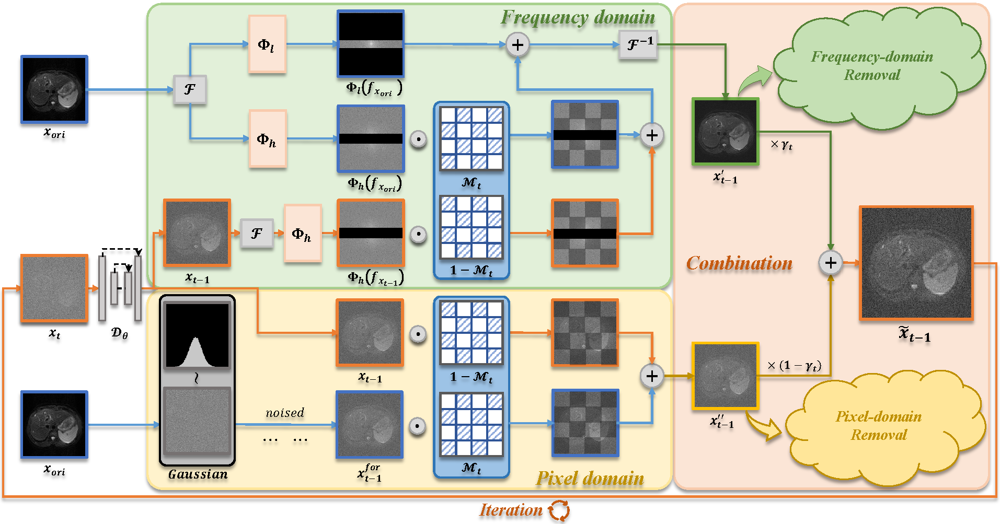

<div align="center">
  
<h1> PFAD for motion artifact removal </h1>

<div>
    <a href="jhxu.xidian@gmail.com" target="_blank">Jiahua Xu</a><sup></sup> | 
    <a href="dwzhou.xidian@gmail.com" target="_blank">Dawei Zhou</a><sup></sup> | 
    <a href="hulei@gdph.org.cn" target="_blank">Lei Hu</a><sup></sup> | 
    <a href="jianfengguo@hbmu.edu.cn" target="_blank">Jianfeng Guo</a><sup></sup> |
    <a href="haitang76@163.com" target="_blank">Feng Yang</a><sup></sup> 
    </br>
    <a href="liuzaiyi@gdph.org.cn" target="_blank">Zaiyi Liu</a><sup></sup> |
    <a href="nnwang@xidian.edu.cn" target="_blank">Nannan Wang</a><sup></sup> |
    <a href="gaoxb@cqupt.edu.cn" target="_blank">Xinbo Gao</a><sup></sup> 
</div>

</br>

<div>
    <sup></sup>AAAI 2025
</div>
</br>

[](https://arxiv.org/abs/2412.07590)

</div>


---

This is the codebase for the article [Motion Artifact Removal in Pixel-Frequency Domain via Alternate Masks and Diffusion Model](https://arxiv.org/pdf/2412.07590) (AAAI 2025).

This repository is based on [guided-diffusion](https://github.com/openai/guided-diffusion).

## Overview

PFAD is a method for medical image motion artifact removal using pixel-frequency domain information combined with alternate masks.



## Quick Start

**Download the pre-trained model**

We provide the pre-trained model for HCP dataset, please save it to ```results/model/brain```. 

Here are the download link: 
[Google Drive](https://drive.google.com/file/d/1Hh0wabKmW5CUXpUAS4GcEHZIoYeZq_v-/view?usp=sharing)

**Artifact removal via the pre-trained model**

At the beginning, we need to build an environment called ```artifact_removal```.
```
conda env create -f environment.yml
```
To get the inference results of PFAD, please run:
```
cd scripts
python image_sample.py --conf_path ../conf/brain_sample_config.yml --img_dir brain --save_path motion_remove
```
Then, you can obtain the results of the example images after removing motion artefacts in ```results/motion_remove```

We currently only provide the code for the inference process, you can refer to [guided-diffusion](https://github.com/openai/guided-diffusion) for training process.

## Results

We show the visualization results on HCP (Brain dataset).


## Contact

If you have any questions, please contact jhxu.xidian@gmail.com.

